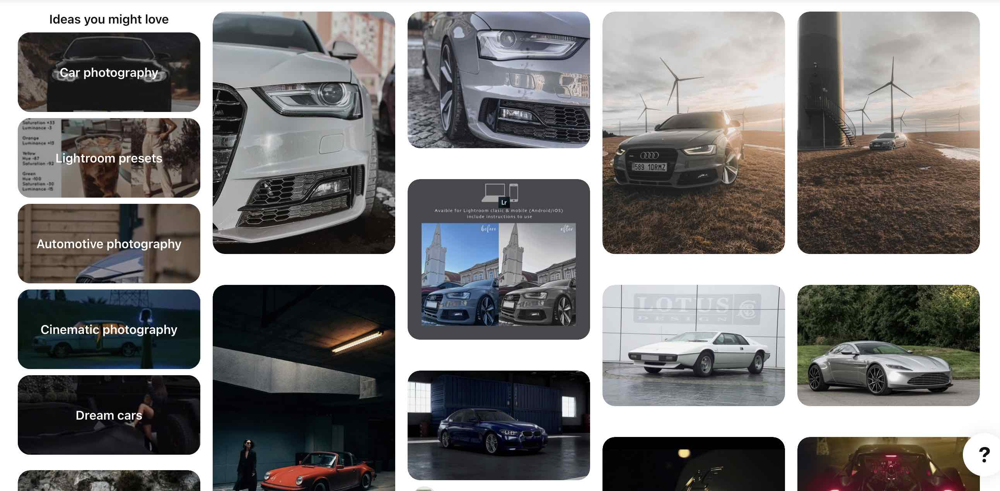

# cinematic-framework
**```Cinematic make things different```**, unofficial (framework) empower us capture spectacular memos of our automobile  



### ```Why does it matter/ any solutions?```
**Before begin** make sure we could answer the bellow pseudo-question about cinematic:

- Camera gears play an big role in motion graphic?
- What are the main purpose of camera gear in cinematic?
- Could we explain "photography-terms" in a dummy sense?
- Do we need fancy camera or we could enable those amazing shot with HDR mobile lens camera?
- Does camera angles play an enormous in cinematic metrology? 
- Placing an object play an big role, how could we suggest which location and angle as best practice?
- Background lighting dim effect directly on camera shot?
- Lens ISO (sensitivity to light) support to add deep in to object shots?
- ...

Hahaha someone is making an video :)))

[](https://www.youtube.com/watch?v=dgRSl7JNohk)

---
#### ```Opportunity-adventures```
Drone are smart could we assemble for the cinematic shots! (upper shots, wide angles) always better.
1. drone-framework (golang) : https://github.com/hybridgroup/gobot
1. drone-framework (esp32-arduino) : https://github.com/ArduPilot/ardupilot
1. drone-frame (quadcopter, carbon fiber) https://github.com/dipree/alpaca